# Вопросы к ОАиПу сиквел

## 1. Понятие сложности алгоритма, оценки времени исполнения.
### Временная сложность
Временная сложность алгоритма определяется как функция от размера данных и равна времени работы алгоритма на данном вводе.  
Чаще всего выражается в нотации Ландау (О-большое), в которой учитываются только слагаемые высших порядков и не учитываются константные множители. Такое определение временной сложности называется асимптотическим. Асимптотическая оценка временной сложности алгоритма корректна только для ввода, размер которого стремится к бесконечности.  
Временная сложность вычисляется путем подсчета количества элементарных операций, время выполнения каждой из которых -- О(1).  
В данной нотации существуют также обозначения Θ(n), Ω(n), T(n).
- T(n) обозначает количество всех действий, выполненных алгоритмом 
- Θ(n) обозначает нижнюю оценку. Если алгоритм требует Θ(log(n)) операций, то он требует не менее k*log(n) операций, где k -- некоторая константа.
- O(n) обозначает верхнюю оценку. Если алгоритм требует O(log(n)) операций, то он требует не более k*log(n) операций, где k -- некоторая константа.
- Ω(n) обозночает точную оценку. Если алгоритм требует Ω(log(n)) операций, то он требует не более k1*log(n) операций и не менее k2\*log(n) операций, где k1, k2 -- некоторые константы.

| Название | Время работы (T(n)) | Пример алгоритма|
| --------------- | --------------- | --------------- |
| константное | О(1) | побитовый сдвиг числа на 1 |
| дважды логарифмическое| O(log(log(n))) | интерполяционный поиск при равномерном распределении |
| логарифмическое | O(log(n)) | поиск в двоичном дереве поиска |
| линейное | O(n) | поиск наибольшего элемента в неотсортированном массиве |
| линейно-логарифмическое | O(n*log(n)) | наиболее быстрая сортировка сравнением |
| квадратичное | O(n²) | сортировка пузырьком |
| кубическое | O(n³) | обычное умножение матриц |
| экспоненциальное | 2^P(n)* | *P(n) - произвольный многочлен от n|
| факториальное | O(n!) | решение задачи комивояжера полным перебором |

### Пространственная сложность
Пространственная сложность алгоритма определяется аналогично временной, но показвыает объем используемой памяти. Например если алгоритм не использует дополнительной памяти (или использует ее бесконечно мало в сравнении с размером данных), то его пространственная сложность О(1). Например это нахождение наименьшего элемента в неотсортированном массиве.  
Пространственная сложность O(n^2) может возникнуть, если мы имеем функцию f(x,y), где x, y <= n и ее вычисление -- долгий процесс. Тогда вместо вычисления при каждой необходимости можно завести таблицу размера n*n, и  заполнять ее по необходимости.
## 2. Общая классификация вычислительных алгоритмов.
Под "вычислительными" алгоритмами понимаются алгоритмы, используемые для вычисления некоторых математических объектов. Условно их можно поделить на использующие целочисленные значения алгоритмы и алгоритмы, использующие значения с плавающей точкой.  
Вычислительные алгоритмы также можно разделить по области применения:
| Область применения   | Пример алгоритмов |
|--------------- | --------------- |
| теория чисел, вычисление констант и распространенных функций | проверка числа на простоту, разложение числа на множители |
| решение алгебраических задач   | решение СЛАУ  |
| нахождение корней различных уравнений   | решение диффиренциальных уравнений, задачи линейного программирования   |
| приближенное вычисление функций   | приближение функции методом наименьших квадратов |
| вычислительная геометрия  | задача о нахождении площади произвольного многоугольника или класс задач о взаимном расположении фигур |

>я блять хз что тут еще написать

## 3. Точность представления чисел.
Вещественные числа в языке С++ представлены типами float, double и long double, занимающими 4, 8 и 10 байт соответственно (вообще ldouble занимает 16 байт по причине выравнивание). Данные, хранимые в переменных данных типов в памяти представлены согласно стандарту IEEE754. 
>сами про стандарт пишите, мне впадлу

Таким образом тип float имеет 23 значимых для точности бита, тип double имеет 52, а тип long double -- 64. По этой причине проводить операции сравнения со значениями данных типов следует с осторожностью и по возможности лучше использовать выражения вида:
```cpp
long double x = some_func();
long double a = some_other_funt();
if(x - a > 1e-4){
    do_sth();
}
```
## 4. Строковый тип в С++. Представление в памяти. Автоматическое управление памятью для Си строк и `std::string`.
Для представления текстовых данных в языке Си использовались массивы типа char, называемые Си строками. Индикатором их конца служил символ '\\0'. В языке С++ также можно пользоваться строками данного формата, но для повышения удобства работы с текстовыми данными стандартная библиотека содержит класс `std::string`. Данный класс содержит указатель на хранимый текст а также размер строки и объем выделенной памяти. Если для `std::string` автоматическое управление памятью реализованно с помощью механизмов ООП, таких как конструктор и деструктор, которые инкапсулируют выделение памяти, то автоматизация управления памятью для Си строк возможна через механизм умных указателей.  
Умные укзазатели представляют собой класс-обертку над обычным указателем. Существует три вида умных указателей: `unique_ptr`, `shared_ptr`, `weak_ptr`.
### unique_ptr
`unique_ptr` представляет собой умный указатель, единолично владеющий своим ресурсом. Таким образом никакой другой указатель не может указывать на этот же объект (можно сделать 2 юник_птр из двух сишных поинтеров на один и тот же объект, но это УБ, моветон и долбоебизм). Поэтому данный класс реализует только конструктор перемещения и оператор присваивания-перемещением. Поведение при перемещении определено явно.
### shared_ptr
`shared_ptr` представляет собой умный указатель с разделенным владением. На объект может ссылаться неограниченное число `shared_ptr` и `weak_ptr`, при уничтожении последнего `shared_ptr` на объект (выход из области видимости, ручное удаление) память, выделенная на него освобождается. Для этого в каждом экземпляре хранится счетчик, показывающий количество указывающих на объект `shared_ptr`. 
### weak_ptr
`weak_ptr` представляет собой умный указатель с разделенным владением. Он создан для решения проблемы зацикливания в динамических структурах. Представим ситуацию:   
Имеется двусвязный список с подобной структурой:
```cpp
struct Node{
    std::shared_ptr<Node> next;
    std::shared_ptr<Node> prev;
    T value;
};
```
Тогда если мы захотим удалить некоторый постфикс данного списка мы просто сменим указатель в последнем нужном узле на `nullptr`. Но тогда возникнет проблема. 
Первый элемент постфикса не удалится, потму что на него ссылается следующий элемент. Но тогда не удалится и следующий. Получаем утечку памяти.   
Для решения данной проблемы были созданы слабые указатели. Перепишем узел следующим образом:
```cpp
struct Node{
    std::shared_ptr<Node> next;
    std::weak_ptr<Node> prev;
    T value;
}
```
При потере последнего `shared_ptr` на объект он удалится независимо от количества слабых указателей на него.  
Производительность программ с использованием умных указателей отличается от программы использующей обычные указатели незначительно (единственное место потерь это подсчет ссылок в `shared_ptr`)
## 5. Файлы. Двоичное и текстовое представление файлов. Стандартные файлы.
Файл - именованый набор байт, записанный на некотором носителе. Для работы с файлами в языке С++ определены потоки ввода-вывода.

>определение потока из следующего надо сюда вставить.

Файл можно представить в виде текста в некоторой кодировке. Подобное представление файла называется текстовым.
Наименьшей смысловой единицей в таких файлах служит один символ. Они обеспечивают удобство работы с текстовыми данными, но неэффективны, если требуется хранить данные не текстового формата. 
Например запись числа 255 в кодировке utf-8 займет в текстовом формате 3 байта.   
Также файл можно представить как набор байт. В данном формате можно хранить данные напрямую в их двоичном представлении, от этого и название "бинарный файл".
Данный вид файлов позволяет хранить данные более эффективно, например запись числа 255 займет всего 1 байт.
Однако эта эффективность достигается ограничениями на работу. Например нужно либо ввести разделитель -- некоторый символ, или  последовательность байт, обозначающую конец элемента, либо знать точное количество байт, на которых записана нужная информация.
## 6.  Понятие потока. Открытие и закрытие файлов. Операции ввода-вывода. Указатель чтения-записи в файле.
### Понятие потока
Поток (тот что английский `stream`, не `thread`) - абстракция, представляющая собой устройство ввода/вывода. В общем и целом это бесконечный поток байт, который является либо источником, либо назначением. 
Чаще всего потоки связаны с физическим источником данных (файл, клавиатура, консоль). 
В языке С++ потоки буфферизированы, то есть имеют буффер, который хранит в себе введенную/выведенную информацию некоторое время после операции и только потом записывает/считывает ее. Например если посмотреть за файлом `text.txt` во время выполнения данного фрагмента кода, можнно заметить, что после записи в поток файл обновится не сразу.
```cpp
std::ofstream os;
os.open("text.txt");
os << "AAAAAAAAAAA"; //<- смотрим здесь
os.flush(); //<- и здесь
```
Сделано это для оптимизации, так как множественное обращение к файлу для чтения/записи затратно. Поэтому поток буфферизирует ввод/вывод.
### Открытие/закрытие файлов
Для потоков открытие файлов происходит с помощью метода open класса `basic_fstream`.
Данный метод вызывается с параметрами `filename` и `mode`, где первый это полное имя файла, второй -- режим открытия. 
| Константа   | Суть |
|--------------- | --------------- |
| app   | append, открыть для дозаписи в конец |
| binary   | открыть в режиме двоичного файла |
| out   | открыть для записи |
| in   | открыть для чтения |
| trunc | удалить содержимое файла при открытии |
| ate | выставить начальную позицию для записи в конец|
| noreplace | не позволяет открыть файл, если он существует, но не указаны флаги app или ate   |

>разница между ate и app заключается в том, что ate выставляет указаетль в конец однократно, а app перед каждой операцией ввода

Режимы открытия представлены числовыми константами.
### Операции ввода-вывода
Для совершения операций ввода-вывода для потоков перегружены операторы `>>` и `<<`, для потоков ввода и вывода соответственно.
Для потоков ввода-вывода определены таже форматирующие метод, флаги и манипуляторы (если надо опять писать про эти модификаторы сиаута я хочу умереть)
### Указатель чтения-записи в файле
Указатель чтения-записи представляет собой 64-разрядное значение смещения от начала файла до следующего байта для чтения-записи.
При открытии файла данное значение устанавливается равным нулю если не было установлено иное правило.

## 7. Проверка операций ввода-вывода. Пример.
без комментариев пока что
## 8. Функции для модификации содержимого файла: futc, getc, feof, fputs, fgets, fprintf, fscanf, rewind.
| Функция   | Сигнатура | Возвращаемое значение |Пояснение    |
|--------------- | --------------- |--------------- | --------------- |
| fputc   | int fputc(int ch, FILE* stream)   | значение записанного символа (при успехе), EOF при неудаче, также выставляет индикатор ошибки в потоке |   записывает символ в Си поток в позицию, соответствующую текущему значению указателя ввода-вывода|
| fgetc  |  int fgetc(FILE* stream) |  прочитанный символ или EOF (в случае достижения конца файла выставляет индикатор EOF, в ином случае индикатор ошибки)|считывает следующий символ из потока по указателю ввода-вывода и переводит его в следующую позицию|
| feof | int feof(FILE* stream)   |  ноль, если не был достигнут конец потока, иначе не ноль| проверка на EOF (End Of File кто не знал вдруг)|
| fputs   | int fputs(const char* str, FILE* stream) |  при успехе неотрицательное значение, при неудаче EOF и выставляет индикатор ошибки   |записывает все символы строки str кроме нуль-терминатора в поток|
| fgets   |  char* fgets(char* str, int count, FILE*)   |  str в случае успеха, nullptr в случае неудачи   |читает не более `count - 1` символов из потока и записывает их в массив символов представленный параметром `str`. При встрече символа перехода на следующую строку чтение обрывается и в строку записывается символ перехода на следующую строку. Если байты были прочитаны, записывает в конец строки нуль-терминатор|
| fprintf   | int fprintf(FILE* stream, const char* format, ...)  |  количество записаных символов при успехе, отрицательное число при ошибке| записывает данные в поток в соответствии с форматом, указанным в параметрах |
| fscanf   | int fscanf(FILE* stream, const char* format, ...) |  количество считаных аргументов в случае успеха, EOF в случае ошибки | считывает данные из потока, интерпретирует их в соответствии с форматирущей строкой |
| rewind   |  void rewind(FILE* stream) | void | переводит указатель ввода-вывода в начало потока (эквивалентна fseek(stream, 0, SEEK_SET), но дополнительно очищает идентификаторы ошибки и конца файла);    |

Перечисленные функции являются унаследованными от языка Си и не рекомендуются к использованию без явной на то необходимости. 

## 9. Функции для модификации содержимого файла: ferror, fwrite, fread, fileno, filelength, chsize, ftell, fgetpos, fseek.
| Функция   | Сигнатура | Возвращаемое значение |Пояснение    |
|--------------- | --------------- |--------------- | --------------- |
| ferror | int ferror(FILE* stream) | ненулевое значение если установлен идентификатор ошибки, иначе 0 | проверяет поток на ошибку |
| fwrite | size_t fwrite(const void* buffer, size_t size, size_t count, FILE* stream) | количество записаных объектов <= `count` | записывает `count` объектов байтами, размер объекта указывается в `size`. Если объект не является тривиально копируемым, то поведение не определено|
| fread | size_t fread(void* buffer, size_t size, size_t count, FILE* stream) | количество считаных объектов| считывает count объектов из потока, каждый в виде массива байт. Если объект не является тривиально копируемым, то поведение не определено |
| fileno | int fileno(FILE* stream)| системный дескриптор файла при успехе, иначе -1 и выставит идентификатор ошибки | возвращает дескриптор файла (как же я хочу чтобы меня при изучении С++ спрашивали про сишные функции, еще и с ОСной хуйнёй типа дескрипторов 🥰 кста почему-то этой функции нет на cppreference, хотя она существует до сих пор...) |
| filelength | long _filelength(int fd) | длина файла, ассоциированого с переданным дескриптором в байтах| читай возвращаемое значение. Отличие от filesize() в том, что файл должен быть открыт. Данная функция не включена в стандарт и вообще существует только на винде. Какого дьявола она забыла в вопросах к экзамену, когда одно из требований было сдавать лабы на линуксе... |
| chsize | int _chsize(int fd, long size) | 0 если размер был изменен успешно, -1 при ошибке + выставляет индикатор ошибки | изменяет размер файла с дескриптором `fd` на `size`. Какого хуя опять виндовская хуйня, ну что это вообще такое|
| ftell   | long ftell(FILE* stream)| указатель ввода-вывода при успехе, иначе -1| возвращает значение указателя ввода-вывода, для бинарного файла это колчичество байт от начала файла|
| fgetpos | int fgetpos(FILE* stream, fpos_t* pos) | 0 при успехе, иначе ненулевое значение + выставляет индикатор ошибки| записывает указатель ввода-вывода в `pos`, данное значение имеет смысл только как аргумент для fsetpos|
| fseek | int fseek(FILE* stream, long ofset, int origin) | 0 при успехе, иначе ненулевое значение| устанавливает указатель ввода-вывода для переданного потока на `offset` от `origin`|

Тривиально копируемый объект это:
1. объект скалярного типа (арифметические, перечислительные и указатели)
2. тривиально копируемый класс

Тривиально копируемый класс это класс, который:
- имеет хотя бы один подходящий конструктор копирования, конструктор копирования перемещения, оператор присваивания копирования, или оператор присваивания перемещения
- каждый из перечисленных выше элементов тривиален (т.е. не предоставлен пользователем и у типа нет виртуальных методов и виртуального класса-родителя + конструкторы всех полей тривиальны и конструкторы всех родительских классов тривиальны)

Значения `origin`:
- SEEK_SET -- поиск от начала
- SEEK_CUR -- поиск от текущей позиции указателя ввода-вывода
- SEEK_END -- поиск от конца файла


Перечисленные функции являются унаследованными от языка Си и не рекомендуются к использованию без явной на то необходимости. 
## 10. Типы данных – простые и составные. Агрегирование данных.
### Система типов в C++
Тип данных -- атрибут объекта, определяющий какого рода данные могут храниться в объекте, представление данных в памяти и операции, проводимые над данными типами данных. Т.е. он характеризует множество допустимых значений и набор допустимых операций.   
Стандарт C++ представляет следующий вариант классификации типов:
- фундаментальные:
    - `void`
    - `nullptr_t`
    - арифметические типы данных:
        - целочисленные (в т.ч. `bool`, символьные типы)
        - вещественные (типы с плавающей запятой)
- составные:
    - ссылочные типы (`lvalue`- и `rvalue`-ссылки)
    - типы указателей (указатели на объекты и на функции)
    - типы указателей на член (указатель на поле (член с данными) и на метод (функция-член))
    - типы массивов (забавный факт на день: `std::array` не является типом массива)
    - типы функций (`std::function`, лямбды и классы с перегруженным оператором `()` не относятся к типам функций)
    - типы перечислений
    - типы классов (в том числе и объединения)

Стоит учесть, что в представленном выше списке под типом имеется в виду cv-квалифицированная версия если не сказано обратное

### Агреатные типы
Агрегатным типом называется массив или класс без пользовательских или унаследованных конструкторов, без базовых классов и виртуальных функций, без `private` и `protected` нестатических данных и без инициализации по умолчанию для членов.

## 11. Указатели и ссылки в языке С++. Семантика копирования и перемещения.
### Указатели
Указателем в языке C++ называется число размера равного разрядности операционной системы, обозначающее адрес в памяти некоторого объекта или функции (а точнее адрес первого байта объекта). Указатель на объект может быть получен путем присваивания возвращаемого значения оператора `&`, примененного к любому выражению объектного типа (объектный тип -- не функциональный тип, не ссылочный тип и не void) или обращением к полю класса, тип которого является указателем, а также путем применения оператора `new`.   
### Ссылки
Ссылкой называется псевдоним для уже существующего объекта или функции. Различают `lvalue`- и `rvalue`-ссылки.
#### lvalue-ссылки
`lvalue`-ссылкой называется ссылка на `lvalue`-выражение. К `lvalue`-выражениям относятся (да начнется пиздец):
- имя переменной, функции, объект шаблонного параметра или члена вне зависимости от типа. 
- вызов функции, возвращаемое значение которой -- `lvalue`-ссылка 
- `a = b`, `a += b` и все другие встроенные операторы присваивания и составного присваивания
- `++a` и `--a` (встроенный пост-инкремент и декремент)
- `*p`
- `a[n]` и `p[n]`, где a -- lvalue-массив, p -- указатель
- `a.m`, если m не является перечислением или нестатическим методом или если a -- 'rvalue', m нестатический член объектного типа
```cpp
struct foo{
    enum bar{
        m
    };
};

void baz(){
    foo a;
    a.m = 52; //Ошибка, a.m не lvalue 
}
```
- `p->m` аналогично `a.m`
- строковый литерал `"Hello, World!"`
- тернарный оператор `a? b:c`, если `b`, `c` -- `lvalue` одного типа
- выражение приведения к `lvalue`-ссылке `static_cast<int&>(x)`
`lvalue`-ссылки ведут себя как псевдонимы для объекта, на который ссылаются.

#### rvalue-ссылки
Аналогично `rvalue`-ссылкой называется ссылка на `rvalue`-выражение. К ним относятся:
- prvalue:
    - литералы (кроме строковых)
    - вызов функции, возвращаемое значение которой не `lvalue`-ссылка
    - `a++` и `a--`
    - все встроенные арифметические, логические выражения и выражения сравнения (`a + b`)
    - `&a`
    - `a.m` и `p->m`, если `m` -- нестатический метод или перечисление
    - `this`
    - приведение к нессылочному типу `static_cast<int>(x)`
    - лямбда
- xvalue (expiring value)
    - `a.m`, где `a` -- `rvalue`, а `m` -- нестатический член
    - вызов функции(оператора), возвращаемое значение которой -- `rvalue`-ссылка
    - приведение к `rvalue`-ссылке `static_cast<int&&>(x)`
    - `a[n]`, где `a` -- `rvalue` массив
### move-семантика  
С C++ 11 появилась  возможность продлить время жизни временных объектов до времени жизни ссылки на них. Вместе с этим появилась возможность забирать ресурс у временного объекта вместо его копирования т.к. временный ресурс все равно будет уничтожен при выходе из конструктора.
Для реализации данного поведения была введена семантика перемещения.
```cpp
class A{
    int* resource = nullptr;
    A(A&& a){
        std::swap(this->resource, a.resource);
    }
    A&(A&& a){
        delete[] this->resource;
        std::swap(this->resource, a.resource);
        return *this;
    }
}
```
Как видно из примера конструктор копирования просто перемещает владение ресурсом данному экземпляру класса и очищает переданную ссылку. Это позволяет избежать ненужного копирования в подобных ситуациях:
```cpp
std::string s1 = "AAA";
std::string s2 = "BBB";
std::string s3(s1 + s2);
```
Ресурсы `s3` будут перемещены из результата конкатенации так как в копировании нет смысла.   
Но если наш класс имеет более сложные поля, например строки, то нам поможет функция `std::move`. Данная функция переводит свой аргумент к `rvalue`-ссылке
```cpp
class B{
    std::string field;
    int* resource = nullptr;
    B(B&& b): field(std::move(b.field)){
        std::swap(this->resource, b.resource);
    }
    B&(B&& b){
        this->field = std::move(b.field);
        std::swap(this->resource, b.resource);
        return *this;
    }
}
```
>Важно: если не был определен конструктор перемещение, передача `rvalue`-ссылки в конструктор приведет к копированию (если конструктор копирования не был явно удален, но это уже вообще пиздец)
+ пранк на сладенькое
```cpp
void func(const int& x){
    std::cout << "I'm a lvalue reference";
}
void func (int&& x){
    std::cout << "I'm a rvalue reference";
}

int main(){
    int&& ref{6};
    func(ref);
}
```
## 12. Функции в языке С++. Понятие метода. Рекурсия.
### Функции в языке С++
**Функция** в C++ — это именованный блок кода, который выполняет определенную задачу и может быть вызван из других частей программы. Функции помогают структурировать код, делая его более читаемым и управляемым, а также позволяют избежать дублирования кода.
#### Объявление и определение функции
Функция должна быть объявлена перед тем, как её можно будет использовать. Объявление функции (прототип) включает в себя тип возвращаемого значения, имя функции и список параметров. Определение функции включает тело функции.
```cpp
// Объявление функции (прототип)
int sum(int a, int b);

int main() {
    // Немного кода
    return 0;
}

// Определение функции
int sum(int a, int b) {
    return a + b;
}
```
### Понятие метода
Метод — это функция, которая является частью класса. Методы определяются внутри класса и имеют доступ к его данным и другим методам. Методы могут быть обычными, статическими и константными.

- **Обычные методы** имеют доступ к данным конкретного объекта класса.
- **Статические методы** принадлежат классу, а не конкретному объекту. Они могут вызываться без создания экземпляра класса.
- **Константные методы** не изменяют состояние объекта.
```cpp
class MyClass {
public:
    void defaultMethod() {
        // Код
    }
    static void staticMethod() {
        // Код
    }
    void constMethod() const {
        // Код
    }
};

int main() {
    MyClass obj;
    obj.defaultMethod(); // Вызов обычного метода
    MyClass::staticMethod(); // Вызов статического метода
    obj.constMethod(); // Вызов константного метода
    return 0;
}
```
### Рекурсия
Рекурсия — это способ определения функции, при котором функция вызывает саму себя. Рекурсивные функции используются для решения задач, которые можно разбить на несколько подзадач того же типа.

Рекурсивная функция обязательно должна иметь базовый и рекурсивный случаи.
- Базовый случай - это условие выхода из рекурсии, где функция перестает вызывать саму же себя.
- Рекурсивный случай - это условие, в котором функция вызывает саму себя.
#### Пример рекурсивной функции - вычисление факториала числа
```cpp
int factorial(int n) {
    if (n <= 1) {
        return 1;
    } else {
        return n * factorial(n - 1);
    }
}
```

## 13. Указатели на функции в языке С++.
**Указатель на функцию** (function pointer) хранит адрес функции. По сути указатель на функцию содержит адрес первого байта в памяти, по которому располагается выполняемый код функции.

Самым распространенным указателем на функцию является ее имя. С помощью имени функции можно вызывать ее и получать результат ее работы.

Но также указатель на функцию мы можем определять в виде отдельной переменной с помощью следующего синтаксиса:

`тип (*имя_указателя) (типы_параметров);`
- **тип** представляет тип возвращаемого функцией значения.
- **имя_указателя** представляет произвольно выбранный идентификатор в соответствии с правилами о наименовании переменных.
- **параметры** определяют типы параметров через запятую (при их наличии).

Указатель может указывать только на такую функцию, которая имеет тот же возвращаемый тип и типы параметров, что и определение указателя на функцию.

`void (*message) ();`

В данном случае определен указатель, который имеет имя **message**. Он может указывать на функции без параметров, которые возвращают тип void (то есть ничего не возвращают).

Пример использования:
```cpp
#include <iostream>
 
void hello() {
    std::cout << "Hello, World" << std::endl;
}
void goodbye() {
    std::cout << "Good Bye, World" << std::endl;
}
  
int main() {
    void (*message)();  // определение указателя на функцию
      
    message=hello;
    message();
    message = goodbye;
    message();
}
```
Также допустимо такое обращение к указателю на функцию:

`(*message)();`

### Определение и инциализация указателя
При определении указатель можно сразу инициализировать:
```cpp
void (*message)() {hello}; // указывает на функцию hello
// или так
void (*message2)() =hello; // указывает на функцию hello
```
Можно инициализировать значением nullptr:
```cpp
void (*message)() { nullptr};
```
Если указатель при определении инициализируется какой-либо функцией, то можно опустить все определение типа и просто использовать слово auto (но использование auto не рекомендуется):
```cpp
auto message { hello}; // указывает на функцию hello
auto message2 = hello; // указывает на функцию hello
```
Можно подчеркнуть, что переменная является именно указателем, указав после auto символ звездочки:
```cpp
auto* message { hello};
```
Но особой разницы - что со звездочкой, что без звездочки нет.

Стоит отметить, что при присвоении функции мы можем применять операцию получения адреса:

`auto message { &hello};`

Но в принципе применение такого символа, как и символа звездочки с auto, ни на что не влияет.

### Массивы указателей на функции
Кроме одиночных указателей на функции мы можем определять их массивы. Для этого используется следующий формальный синтаксис:

`тип (*имя_массива[размер]) (параметры)`

Например:

`double (*actions[5]) (int, int)`

Данный массив содержит 5 указаетелей на функции, возвращающие числа типа double и принимающие 2 значения типа int в качестве параметров.

### Использование
Указатели на функции используются в основном для передачи их в качестве аргументов в другие функции и для имитации виртуальных методов. Также нередко используются для реализации коллбеков.
## 14. Библиотечные модули пользователя. Назначение модуля. Структура модуля. Синтаксис и назначение разделов модуля. Пример.
Библиотечным модулем пользователя или библиотекой называется отдельно компилируемый набор ресурсов (функций, классов, констант и т.п.), разрабатываемый и хранимый независимо от использующих его программ.   
Основным назначением библиотеки является повторное использование типовых ресурсов, которые могут использоваться в любом проекте.    
Обычно библиотека состоит из заголовочного файла, в котором представлены прототипы всех функций, константы и объявления классов и скомпилированного объектного файла, который содержит реализацию объявленного функционала.   
Библиотеки компилируются отдельно так как их функционал не меняется на уровне приложения и их перекомпиляция не имеет смысла, затрачивая ресурсы системы. Также из скомпилированных объектных файлов трудно получить доступ к исходному коду реализаций, что позволяет облегчить распространение программ с закрытым исходным кодом.     
Библиотеки делятся на статические и динамические.
### static lib
Статическая библиотека связывается с разрабатываемым приложением во время компиляции и ее код становится частью исполняемого файла. Это гарантирует наличие библиотеки у пользователя, но если данная функциональность используется несколькими приложениями, то это может приводить к потере места. Также при обновлении самой библиотеки требуется замена всего исполняемого файла.
### dynamic lib
Динамические библиотеки связываются во время работы приложения и являются отдельной единицей. Большим ее преимуществом является возможность использовать ее из многих приложений. Также ее обновление весьма просто, так как нужно просто заменить библиотечный файл на более новый.
>че значит пример? Примером динамической библиотеки может служить Qt, статической же -- Google test
## 15. Программирование статистических и динамических библиотек. Подключение в различных средах.
Все еще: 
ПОМОГИТЕ Я ПРОШУ ВАС   
ПУСТЬ ЭТОТ ВОПРОС НЕ ПОПАДЕТСЯ НИКОМУ!!!

Но:
### Программирование статистических и динамических библиотек
Оба типа библиотек используются для организации кода и его повторного использования, но они различаются способом загрузки и использования в программе.
#### Статическая библиотека
- Объединяет объектные файлы в один файл, который затем включается в исполняемый файл при компиляции.
- Поэтому конечный исполняемый файл автономен, не требует внешних библиотек для выполнения.
#### Динамические библиотеки
- Содержит объектный код, который загружается в память во время выполнения программы. 
- Поэтому при обновлении библиотеки не требует перекомпиляции программы.
### Подключение в различных средах
#### В среде Visual Studio (Windows)
1. Создание статической библиотеки:
    - Создайте проект типа "Static Library".
    - Добавьте заголовочные и исходные файлы.
    - Соберите проект.
2. Создание динамической библиотеки:
    - Создайте проект типа "Dynamic Link Library (DLL)".
    - Добавьте заголовочные и исходные файлы.
    - Соберите проект.
2. Подключение библиотеки к другому проекту:
    - Создайте проект типа "Console Application".
    - В свойствах проекта добавьте путь к заголовочным файлам библиотеки.
    - В свойствах проекта добавьте путь к библиотеке (libmath_utils.lib для статической или math_utils.dll для динамической).
#### В среде GCC (Linux, MacOS)
1. Создание и подключение статической библиотеки:
    - Скомпилируйте библиотеку с помощью ar rcs libmath_utils.a math_utils.o.
    - При компиляции приложения укажите -L. и -lmath_utils.
2. Создание и подключение динамической библиотеки:
    - Скомпилируйте библиотеку с помощью g++ -shared -o libmath_utils.so math_utils.o.
    - При компиляции приложения укажите -L. и -lmath_utils.
    - Установите переменную окружения LD_LIBRARY_PATH на путь к библиотеке.

## 16. Статические и динамические структуры данных. Последовательности и динамические массивы. Реализация операций над последовательностями.
Структура данных -- способ организации однотипных и/или связанных логически данных для простого и эффективного использования.  
Статической структурой данных называется структура данных, память под которую выделяется единожды в компайл-тайме и не перевыделяется/освобождается в рантайме (т.е. массив, кортеж или структура).    
Динамической структурой данных называется структура данных, размер и расположение в памяти которой может меняться в рантайме.
К динамическим СД относятся список, стек, очередь, дек, хеш-таблица, дерево, множество, граф и т.д.   
Динамическим массивом называется массив, выделяемый в рантайме на куче  и имеющий возможность расширяться. Для работы с динамическим массивом в стандартной библиотеке C++ существует класс `vector<T>` с шаблонным параметром типа. Данные в нем хранятся в последовательном участке памяти, поэтому массивы иногда называют последовательностями.  
Для последовательности определены следующие операции:
- метод `at` для получения элемента по индексу с проверкой границ
- оператор `[]` для получения элемента по индексу
- метод `reserve` для изменения вместительности вектора (при необходимости с аллокацией дополнительной памяти)
- метод `resize` для изменения размера вектора
- метод `clear` для очистки содержимого вектора
- метод `insert` для вставки по итератору
- метод `emplace` (`emplace_back`) для конструирования объекта и последующей вставки
- метод `erase` для удаления по итератору
- метод `push_back` для вставки элемента в конец. Нетривиальным является использование placement new в данном методе
- метод `pop_back` для удаления последнего элемента
Нетривиальность метода `push_back` и подобных (`emplace`, `emplace_back`) заключается в использовании placement new. Placement new используется для создания объектов в уже выделенной памяти. Из этого также следует, что нужно вызывать деструкторы объектов вручную.   
Каждое расширение вектора запрашивает участок памяти в 2 раза больше чем его нынешняя вместительность.
### Асимптотическая сложность 
Поиск в неотсортированном векторе -- O(n)
Поиск в отсортированном векторе -- O(log(n))
Вставка в произвольное место -- O(n)
Вставка в конец -- аммортизированное O(1)
Удаление из произвольного места -- O(n)
Удаление из конца -- O(1)
## 17. Линейные списки – основные операции. Реализация списков на основе динамических структур.
Линейный список (он же односвязный) -- динамическая структура данных, порядок следования элементов которой не продиктован их расположением в физической памяти. Пример односвязного списка представлен ниже:
```cpp
template<typename T>
class LinkedList{
    struct Node{
        T value;
        Node* next;
    };
    Node* head;
    Node* tail;
    size_t len;
}
```
Данная структура данных является рекурсивной, так как каждая нода содержит указатель на следующую ноду того же типа.
### Асимптотическая сложность
Поиск -- O(n)
Вставка -- O(1)
Удаление -- O(1)
НО нужно сначала найти этот элемент, так что это как-бы все равно O(n)
Вставка в начало -- O(1)
Вставка в конец (если хранить конец) -- O(1)
В целом их преимущество над динамическими массивами заключается в отсутствии необходимости реаллокации и перемещения в памяти остальных элементов при вставке или удалении.
### Дополнительные варианты реализации
#### Циклические связные списки
В такого рода связных списках последняя нода в цепочке хранит не `nullptr`, а указатель на первую. Использование подобного имеет смысл например в очереди, когда можно хранить 1 указатель вместо двух
#### Защитные ноды
В некоторых реализациях для решения проблемы с итераторами и `nullptr`-ами  используются так называемые защитные ноды. Они позволяют упростить некоторые операции гарантируя наличие следующей ноды для любой из нод
### Просто приколы на всякий
Разворот списка очевидно нужно в каждой ноде поменять указатель на указатель на предыдущую.
```cpp
LinkedList<int> list;
Node* prev_prev_node = nullptr;
Node* prev_node = nullptr; 
Node* cur_node = list.head();
while(cur_node != nullptr){
    if(prev_node != nullptr){
        prev_node.next = prev_prev_node;
        prev_prev_node = prev_node;
    }
    prev_node = cur_node;
    cur_node = cur_node->next;
}
```

Для поиска цикла нужно завести два указателя, один будет двигаться на 1 другой на 2. Если быстрый дошел до конца цикла нет, иначе они встретятся на цикле т.к. расстояние между ними всегда меняется на 1.
## 18. Двусвязный список и его программная реализация. Кольцевые списки. Упорядоченные списки и перестройка списков.
Двусвязный список  -- динамическая структура данных, порядок следования элементов которой не продиктован их расположением в физической памяти. Пример двусвязного списка представлен ниже:
```cpp
template<typename T>
class LinkedList{
    struct Node{
        T value;
        Node* next;
        Node* prev;
    };
    Node* head;
    Node* tail;
    size_t len;
}
```
Данная структура данных является рекурсивной, так как каждая нода содержит указатель на следующую и предыдущую ноду того же типа.
### Асимптотическая сложность
Поиск -- O(n)
Вставка -- O(1)
Удаление -- O(1)
НО нужно сначала найти этот элемент, так что это как-бы все равно O(n)
Вставка в начало -- O(1)
Вставка в конец (если хранить конец) -- O(1)
В целом их преимущество над динамическими массивами заключается в отсутствии необходимости реаллокации и перемещения в памяти остальных элементов при вставке или удалении.
### Дополнительные варианты реализации
#### Защитные ноды
В некоторых реализациях для решения проблемы с итераторами и `nullptr`-ами  используются так называемые защитные ноды. Тогда реализация листа будет выглядеть следующим образом:
```cpp
struct BaseNode{
    BaseNode* next;
    BaseNode* prev;
};
struct Node: public BaseNode{
    T value;
};
```
С такой защитной нодой можно хранить весь список как кольцевой, принцип сходен с односвязным. Тогда вместо конца и начала можно хранить только эту фиктивную ноду.
## 19. Понятие стека. Операции над стеком. Программная реализация стека на основе статического массива.
Стек – это структура данных, которая работает по принципу «последний пришел — первый вышел» (Last-In First-Out). В стеке добавление новых элементов и удаление существующих производится с одного конца, который называется вершиной стека.

Над стеком и его элементами можно выполнять следующие операции:
- добавление элемента в стек (push);
- вытягивание (удаление) элемента из стека (pop);
- просмотр элемента в вершине стека без его вытягивания из стека (top);
- проверка, пустой ли стек (empty);
- определение количества элементов в стеке (size);
Все вышеприведенные операции работают за О(1). Также при необходимоти можно добавить очистку стека, а также вывод.

Стек может быть как динамической так и статической структурой данных, в зависимости от того, на основе чего он реализован. В программировании стек можно реализовывать разными способами, например:
- в виде статического массива (статическая структура данных);
- в виде динамического массива (динамическая);
- в виде односвязного списка (динамическая);
- в виде двусвязного списка (динамическая).

#### Применение стека
- стек вызова функций;
- для записи истории действий, браузера;
- для обратной польской записи;
- для разворота строки или списка;
- в методе цепочек для разрешения колизий в хеш таблицах.

### Программная реализация
#### На основе связанного списка
Программная реализация стека на основе связного списка предполагает хранение указателя на верхний элемент стека. Каждый элемент стека хранит указатель на нижний элемент, и в случае извлечения этого элемента, указатель на верхний элемент переписывается. В случае добавления, создается новый элемент, который начинает указывать на предыдущий, указатель на верхний элемент также переписывается. Данная реализация считается наиболее выгодной, так как нам не важна скорость итерирования по элементам, нам нужен доступ, только к верхнему.

#### На основе статического массива
Программная реализация стека на основе статического массива предполагает фиксированный размер массива и переменную, хранящую индекс верхнего элемента. Ниже представлена реализация:
```cpp
class Stack {
private:
    static const int MAX_SIZE = 100; // Максимальный размер стека
    int arr[MAX_SIZE]; // Массив для хранения элементов
    int top; // Индекс верхнего элемента

public:
    Stack() : top(-1) {} // Конструктор, инициализация пустого стека

    // Добавление элемента в стек
    void push(int value) {
        if (top >= MAX_SIZE - 1) {
            throw std::overflow_error("Stack overflow");
        }
        arr[++top] = value;
    }

    // Удаление элемента из стека и его возврат
    int pop() {
        if (top < 0) {
            throw std::underflow_error("Stack underflow");
        }
        return arr[top--];
    }

    // Просмотр верхнего элемента без удаления
    int peek() const {
        if (top < 0) {
            throw std::underflow_error("Stack is empty");
        }
        return arr[top];
    }

    // Проверка, пуст ли стек
    bool isEmpty() const {
        return top < 0;
    }

    // Возвращение количества элементов в стеке
    int size() const {
        return top + 1;
    }

    // Очистка стека
    void clear() {
        top = -1;
    }
};
```
## 20. Понятие очереди. Операции над очередями. Кольцевая очередь. Деки. Программная реализация очереди на основе статического массива.
Очередь – это структура данных которая состоит из набора элементов которые размещены последовательно друг за другом. При этом добавление элементов осуществляется с одной стороны, а удаление (вытягивание) – с другой стороны. Очередь работает по принципу FIFO (First In — First Out), то есть «первым пришел – первым вышел».

Основные операции над очередью:
- добавление элемента в конец очереди (push);
- вытягивание (удаление) элемента из очереди (pop);
- чтение первого элемента в очереди (front);
- проверка на наличие элементов в очереди (empty);
- определение количества элементов в очереди (size);

Очередь может быть как динамической так и статической структурой данных, в зависимости от того, на основе чего она реализована. В программировании очередь можно реализовывать разными способами, например:
- в виде статического массива (статическая структура данных);
- в виде динамического массива (динамическая);
- в виде односвязного списка (динамическая);
- в виде двусвязного списка (динамическая).

#### Виды очередей
Различают следующие виды очередей:
- простая очередь;
- кольцевая очередь;
- очередь с преоритетом.

В зависимости от того, на чем они реализованы, у них будет разная асимптотика:
- у кольцевой вставка и извлечение за O(1) не в зависимости от структуры;
- у обычной на массиве вствка O(1), извлечение О(n), на списке O(1) и извлечение, и вставка;
> Не знаю насколько нужны очереди с приоритетом, там можно на многих структурах сделать, задание их явно не упоминает.

> Прошу прощения за пасту, так будет проще разобраться и затем пересказать на экзе.

При представлении очереди массивом в дополнение к нему необходимы параметры-указатели: на начало очереди (на первый элемент в очереди) и на ее конец (первый свободный элемент в очереди). При включении элемента в очередь элемент записывается по адресу, определяемому указателем на конец, после чего этот указатель увеличивается на единицу. При исключении элемента из очереди выбирается элемент, адресуемый указателем на начало, после чего этот указатель также увеличивается на единицу.

Со временем указатель на конец при очередном включении элемента достигнет верхней границы той области памяти, которая выделена для очереди. Однако, если операции включения чередовались с операциями исключения элементов, то в начальной части отведенной под очередь памяти имеется свободное место. Для того, чтобы места, занимаемые исключенными элементами, могли быть повторно использованы, очередь замыкается в кольцо: указатели (на начало и на конец), достигнув конца выделенной области памяти, переключаются на ее начало. Такая организация очереди в памяти называется **кольцевой очередью**. Возможны, конечно, и другие варианты организации: например, всякий раз, когда указатель конца достигнет верхней границы памяти, сдвигать все непустые элементы очереди к началу области памяти, но как этот, так и другие варианты требуют перемещения в памяти элементов очереди и менее эффективны, чем кольцевая очередь.

В исходном состоянии указатель на начало и на конец очереди имееют одинаковые значения. При добавлении элементов в очередь указатель на конец может догнать указатель на начало, это указывает на переполнение очереди, но данная ситуация не отличима от начальной. Таким образом, следует оставлять зазор между первым и последним элементом, и когда этот зазор равняется 1, то счиатется, что очередь заполнена. Определение размера состоит в вычислении разности указателей с учетом кольцевой природы очереди.
Чаще всего в качестве "указателей" используют индексы элементов в массиве.

### Дек
Дек - особый вид очереди. Дек (от англ. deq - double ended queue, т.е. очередь с двумя концами) - это такой последовательный список, в котором как включение, так и исключение элементов может осуществляться с любого из двух концов списка. Частный случай дека - дек с ограниченным входом и дек с ограниченным выходом. Логическая и физическая структуры дека аналогичны логической и физической структуре кольцевой FIFO-очереди. Однако, применительно к деку целесообразно говорить не о начале и конце, а о левом и правом конце.

Операции над деком:

- включение элемента справа;
- включение элемента слева;
- исключение элемента справа;
- исключение элемента слева;
- определение размера;
- очистка;
- доступ по индексу.

Физическая структура дека в статической памяти идентична структуре кольцевой очереди. Динамическая реализация является очевидным объединением стека и очереди.

Реализация дека нетривиальна, потому что используется следующяя схема размещения в памяти:

Имеется массив указателей (массив массивов, в дальнейшем массивы, хранимые там будут названы бакетами). 
В нем хранятся указатели на бакеты, в которых и хранятся элементы самого дека. 
Дек можно было реализовать и на обычном линейном массиве, но для избежания инвалидации ссылок и указателей (и возможно для меньшего количества реаллокаций) комитет решил, что именно такая реализация войдет в стандарт.
Тогда для итерации по деку нужны 2 числа: номер бакета и номер элемента в бакете.


Также дек хранит начало и конец в виде пары бакет-индекс.
>Немножко про инвалидацию: представим себе вектор. Возьмем указатель на один из элементов (или даже итератор, т.к. для вектора это все равно указатель), после добавим элемент. Если произойдет реаллокация,то элемент, на который мы взяли указатель будет перемещен в другую область памяти, но нашему указателю об этом никто не сказал. Анлак. 
В деке такого не бывает, т.к. сами элементы не реаллоцируются, а только основной массив указателей, но итераторы все равно инвалидируются (если делать их на указателях(хотя звучит вообще кринжово, он же не должен знать о следующем указателе ничего, хотя они же блять рядом в памяти, как же я сука ненавижу плюсы, это ахуй), если на индексах, то даже не знаю, но там загвоздка в том, что итератор не должен знать ничего о своем контейнере, поэтому скорее всего он инвалидируется все равно) 


#### Применение очереди
- в качестве буфера;
- последовательность операторов в алгоритме которые выполняются друг за другом.

### Программная реализация очереди на статическом массиве
Реализация не кольцевой очереди проста, но очень затратна по времени на удаление элемента, так как нужно перезаписать элементы массива.
```cpp
#include <iostream>
#define MAX_SIZE 100  // Максимальный размер очереди

class Queue {
private:
    int arr[MAX_SIZE];  // Массив для хранения элементов очереди
    int front = 0;          // Индекс переднего элемента очереди
    int rear = -1;           // Индекс заднего элемента очереди
    int size = 0;           // Текущий размер очереди

public:
    // Проверка, пуста ли очередь
    bool isEmpty() {
        return size == 0;
    }

    // Проверка, полна ли очередь
    bool isFull() {
        return size == MAX_SIZE;
    }

    // Добавление элемента в очередь
    void enqueue(int value) {
        if (isFull()) {
            throw "Queue is full";
        }
        rear++;
        arr[rear] = value;
        size++;
    }

    // Удаление элемента из очереди
    int dequeue() {
        if (isEmpty()) {
            throw "Queue is empty";
        }
        int temp = arr[i];
        for (int i = 0; i < rear; i++) {
            arr[i] = arr[i + 1];
        }
        rear--;
        size--;
        return temp;
    }

    // Получение текущего размера очереди
    int getSize() {
        return size;
    }
};
```

## 21. Использование очередей при реализации запросов ввода-вывода Структура данных «список».
Про списки и очереди пишите, про драйвера без комментариев блять
## 22. Программная реализация очереди на основе статического массива.
Повтор 20 вопроса, я ебал рот того
## 23. Многократный поиск на основе использования статистических данных.
Без комментариев
## 24. Нечеткий поиск – поиск «подобной» подстроки. Бинарный поиск.
(Наконец-то вопрос с адекватной формулировкой блин)
Нечетким поиском называется вид поиска строк, которые приблизительно соответствуют некоторому шаблону.
Для определения "подобия" строки используются так называемые метрики "расстояния" между двумя строками. Существуют следующие метрики.
### Расстояние Левенштейна
Еще называемое расстоянием редактирования. 
В общем и целом эта метрика измеряет по модулю разность между двумя последовательностями. 
Определяется как минимальное количество односимвольных операций (вставки, удаления, замены), необходимых для превращения одной строки в другую.
В общем случае им можно даже назначить различные цены.
Вычисляется оно по формуле:

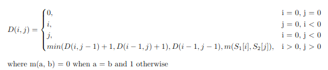 

И представимо в виде таблицы:

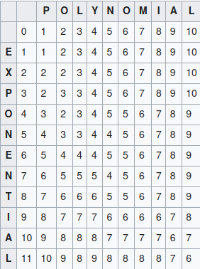
### Расстояние Дамерау-Левенштейна
То же самое, только к списку операций добавляется транспозиция двух соседних символов.
### Алгоритм расширения выборки
При использовании этого алгоритма строится словарь всех "ошибочных" слов по которому потом производится поиск.

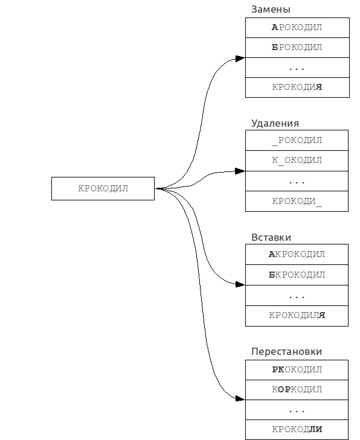 

Но это долго(если число ошибок большое). Возьмем слово алгоритм. Тогда словарь "ошибок" состоит из:
- 8 удалений
- 330 вставок
- 264 замены
- 7 перестановок
>при учете того, что используем только русский алфавит

В итоге получаем 609 вариантов, что в целом терпимо, но при количестве допустимых ошибок более 1 количество вариантов растет очень быстро (при двух ошибках >100k вариантов, дада)
### Метод N-грамм
Принцип данного алгоритма таков: если слово 1 совпадает со словом 2 с несколькими ошибками, то у них с большой вероятностью есть одинаковая подстрока длины N, которая и называется N-грамой.
Слова разбиваются на такие N-граммы, а потом слова попадают в списки ассоциированые с N-граммой. При поиске производится перебор.

 

На практике используются чаще всего триграммы, т.к. выбор большей длины ведет к ограничению на длину слова. Но есть нюанс.
Возьмем слово мыГка, разложим на мыг, ыгк, гка и не найдем слова мышка т.к. ни одной триграммы не совпало. Анлак. 

Можно закинуть триграммы в хеш по индексу их нахождения. Т.к. мы имеем всего k ошибок, то нужно будет посмотреть 2к+1 списков N-грам (к слева, к справа и i-тую)

### Хеширование по сигнатуре
Для каждого слова вычисляется хеш. Хеш вычисляется следующим образом: делим алфавит на N групп.
Тогда если на i-той позиции хеша бит 1, то симмвол из i-той группы присутствует в данном слове без учета порядка следования букв.

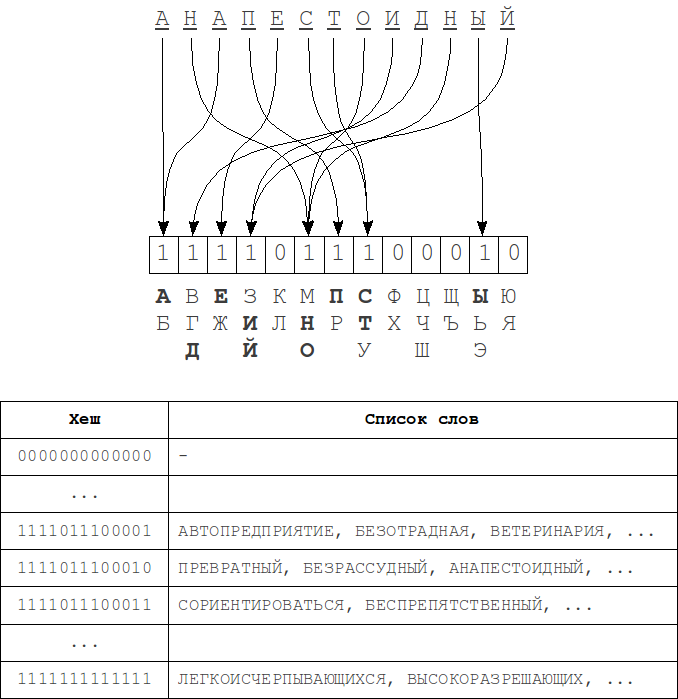 

Тогда при удалении меняется либо 1 бит, либо 0, при вставке то же самое, при замене либо 1 бит, либо 2 бита изменятся.
При перестановках вообще хеш не меняется, так что для полного покрытия к ошибок нужно изменить не менее 2к бит хеша.


### Бинпоиск
Ну он есть, да, асимптотика лог, отсортированность, сами напишете
## 25. Рекурсия: общий вид, свойства, проблемы. Стек вызова функций.
## 26. Сортировки – общая классификация. Сортировки с помощью включения, выделения, обменов.
## 27. Шейкерная сортировка. Сортировка Шелла.
## 28. Сортировка Хоара – алгоритм QuickSort. Сортировка слиянием.
## 29. Бинарные деревья – основные понятия. Основные операции с бинарными деревьями.
Дерево -- граф без циклов. Бинарное дерево  -- дерево, в котором каждый узел называемый родительским может иметь не более двух детей. 
Если некоторый узел имеет два пустых поддерева, он называется листом, листовым узлом, терминальной вершиной.
На практике обычно применяются два подвида: двоичное дерево поиска и двоичная куча.
Над обычными бинарными деревьями определены операции обхода, поиска, вставки и удаления. 
### БСТ
Двоичным деревом поиска называется двоично дерево, удовлетворяющее следующему условию: если k -- ключ вершины x, то все ключи в левом поддереве должны быть меньше k, а в правом больше.
Для бинарных деревьев поиска дополнительно определены 3 вида обхода:
- инфиксный -- левое поддерево, вершина, правое поддерево;
- префиксный -- вершина, левое поддерево, правое поддерево;
- постфиксный -- левое поддерево, правое поддерево, вершина.

Также для них определена операция разбиения дерева по ключу, позволяющая получить два дерева: с ключами < K0 и с ключами >= K0 и обратная операция слияния деревьев с ключами меньшими К0 и большими(или равными) К0.

Для балансировки введена операция поворота.
Левым поворотом называется такая операция, которая меняет отношения между вершинами следующим образом:

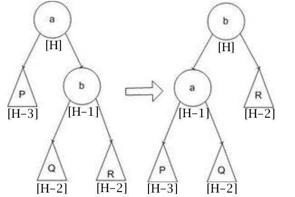

Правый поворот делается аналогичным образом.
### Бин. куча
Двоичной кучей называется такое двоичное дерево, для которого выполняются следующие условия:
- Значение любой вершины не больше (не меньше) значений ее потомков.
- На i-ом слое 2^i вершин, если данный слой не последний. Нумерация с 0.
- Последний слой заполняется слева направо.

Наиболее удобно хранить кучу в массиве (векторе), корень является нулевым элементом, потомки же i-того элемента -- `a[2i+2]` и `a[2i+1]`

Для бин. кучи определена операция восстановления свойств кучи. 
```cpp
void heapify(vector<T>& heap, size_t index, size_t heap_size){
    size_t left = 2*i + 1;
    size_t right = 2*i + 2;
    size_t largest = i;
    if(left <= heap_size && heap[left] > heap[largest]){
        largest = left;
    }
    if(right <= heap_size && heap[right] > heap[largest]){
        largest = right;
    }
    if(largest != i){
        std::swap(heap[largest], heap[i]);
        heapify(heap, largest);
    }
}
```
Тогда для построения кучи можно написать следующую функцию:
```cpp
void buildHeap(vector<T>& vec){
    for(size_t i = std::round(vec.size()); i >= 0; --i){
        heapify(vec, i, vec.size();
    }
}
```
Одним из основных применений бинарной кучи является пирамидальная сортировка.
```cpp
void heapSort(vector<T>& vec){
    buildHeap(vec);
    size_t heap_size = vec.size();
    for(size_t i = vec.size() - 1; i >= 0; --i){
        std::swap(vec[0], vec[i]);
        heap_size -= 1;
        heapify(vec, 0, heap_size);
    }
}
```
## 30. Понятие рекурсивного типа данных.
В информатике рекурсивными типами данных называются типы данных, которые могут содержать значения, принадлежащие этому же типу данных. Примером может служить структура Node, представляющая собой узел односвязного списка.
```cpp
struct Node{
    T value;
    Node* next;
}
```
Также рекурсивным типом данных считается узел дерева.
```cpp
struct TreeNode{
    std::pair<K,V> kv;
    TreeNode* parent;
    TreeNode* left;
    TreeNode* right;
}
```
## 31. Поиск и включение для деревьев. Исключение для деревьев.
Это типа поиск, вставка и удаление? ну сюда рбт и авл кажется, иначе тут вообще нет смысла
## 32. Сбалансированные деревья. Сортировка с помощью бинарных деревьев (кучи).
Сбалансированным деревом (по Ганусевичу) является такое дерево, высоты поддеревьев которого пропорциональны, т.е. отношение их о(1).
Бинарное дерево называется сбалансированным, если для любой его вершины v высоты левого и правого поддерева, выходящих из v (т.е. поддеревьев с корнями v->left и v->right), отличаются не более чем на 1.
Бинарное дерево называется идеально сбалансированным, если длины всех ветвей, начинающихся в корне дерева и заканчивающихся в узле с хотя бы одним из нулевых указателей v->left и v->right, отличаются не более чем на 1.
хипсорт где-то выше был уже.
Сбалансированность дерева требуется для сохранения логарифмической сложности операций, например если в обычное бст вставить значения от 1 до 10 последовательно, получится не бст, а линкед лист с операциями за О(n). Для этого придумали операции балансировки деревьев и самобалансирующие деревья. К ним относятся АВЛ-деревья, красно-черные, сплей-деревья, Б-деревья, 2-3 деревья и др.
### AVL
AVL-деревом называется бинарное дерево поиска, для которого разница высот поддеревьев каждой вершины не больше одного.

Все операции за лог.

#### повороты
левый правый это понятно, они появляются когда дельта высот поддеревьев равна 2 по модулю
большой левый это правый относительно правого сына потом левый делается когда дельта для сына равна по модулю 1.
большой правый наоборот, левый отн. левого сына, потом правый. тоже дельта равна 1 по модулю
#### поиск 
очевидно как в любом бст
#### вставка
ищем место куда вставить, вставляем, рекурсивно обновляем высоту и ребалансим
#### удаление 
ищем удаляемый, удаляем, обновляем высоту и ребаланс
#### код
```cpp
//оставь нажежду всяк сюда входящий
template <typename K, typename V>
class AVLTree {
   protected:
    struct Node {
        std::pair<K, V> kv;
        int8_t height_ = 0;
        Node* left;
        Node* right;

        Node(K key, V value) {
            this->kv.first = key;
            this->kv.second = value;
            this->left = nullptr;
            this->right = nullptr;
        }

        Node(const Node& other) {
            this->kv = other.kv;
            this->left = other.left;
            this->right = other.right;
            this->height_ = other.height_;
        }
    };

    Node* root_ = nullptr;

   public:
    AVLTree() {}

    void insert(std::pair<K, V> kv_pair) {
        this->ins(this->root_, kv_pair.first, kv_pair.second);
    }

    void del(K key) { this->root_ = rmKey(this->root_, key); }
    /* это забейте, миск
    QString infTraverse() {
        QString ans;
        infixTraverse(this->root_, ans);
        return ans;
    }

    QString prefTraverse() {
        QString ans;
        prefixTraverse(this->root_, ans);
        return ans;
    }

    QString postfTraverse() {
        QString ans;
        postfixTraverse(this->root_, ans);
        return ans;
    }
    */
   private:
    int8_t height(Node* node) { return (node) ? node->height_ : -1; }

    int32_t balanceFactor(Node* node) {
        if (node == nullptr) {
            return 0;
        }
        return this->height(node->right) - this->height(node->left);
    }

    void updateHeight(Node* node) {
        if (node != nullptr) {
            node->height_ =
                std::max(this->height(node->right), this->height(node->left)) +
                1;
            updateHeight(node->left);
            updateHeight(node->right);
        }
    }

    void swap(Node* n1, Node* n2) {
        K n1_key = n1->kv.first;
        n1->kv.first = n2->kv.first;
        n2->kv.first = n1_key;
        V n1_val = n1->kv.second;
        n1->kv.second = n2->kv.second;
        n2->kv.second = n1_val;
    }

    void rotateLeft(Node* node) {
        swap(node, node->right);
        Node* q = node->left;
        node->left = node->right;
        node->right = node->left->right;
        node->left->right = node->left->left;
        node->left->left = q;
        this->updateHeight(node->left);
        this->updateHeight(node);
    }

    void rotateRight(Node* node) {
        swap(node, node->left);
        Node* q = node->right;
        node->right = node->left;
        node->left = node->right->left;
        node->right->left = node->right->right;
        node->right->right = q;
        this->updateHeight(node->right);
        this->updateHeight(node);
    }

    void rebalance(Node* node) {
        this->updateHeight(node);
        if (this->balanceFactor(node) == -2) {
            if (this->balanceFactor(node->left) > 0) {
                this->rotateLeft(node->left);
            }
            this->rotateRight(node);
            return;
        }
        if (this->balanceFactor(node) == 2) {
            if (this->balanceFactor(node->right) < 0) {
                this->rotateRight(node->right);
            }
            this->rotateLeft(node);
            return;
        }
    }

    void ins(Node*& root, K key, V val) {
        if (root == nullptr) {
            root = new Node(key, val);
            return;
        }
        if (key < root->kv.first) {
            ins(root->left, key, val);
        } else {
            ins(root->right, key, val);
        }
        rebalance(root);
    }

    Node* min(Node* node) {
        return (node->left != nullptr) ? this->min(node->left) : node;
    }

    Node* max(Node* node) {
        return (node->right != nullptr) ? this->max(node->right) : node;
    }

    Node* rmMin(Node* node) {
        if (node->left == nullptr) {
            return node->right;
        }
        node->left = this->rmMin(node->left);
        return this->rebalance(node);
    }

    Node* rmKey(Node* node, K key) {
        if (node == nullptr) {
            return nullptr;
        }
        if (key < node->kv.first) {
            node->left = this->rmKey(node->left, key);
        } else if (key > node->kv.first) {
            node->right = this->rmKey(node->right, key);
        } else {
            if (node->left == nullptr || node->right == nullptr) {
                node = (node->left == nullptr) ? node->right : node->left;
            } else {
                Node* max_left = this->max(node->left);
                swap(node, max_left);
                node->left = rmKey(node->left, max_left->kv.first);
            }
        }
        rebalance(node);
        return node;
    }

    Node* find(Node* root, K key) {
        if (root == nullptr) {
            return nullptr;
        }
        if (key == root->kv.first) {
            return root;
        }
        if (key < root->kv.first) {
            return find(root->left, key);
        }
        return find(root->right, key);
    }

    void infixTraverse(Node* root, QString& elems) {
        if (root == nullptr) {
            return;
        }
        infixTraverse(root->left, elems);
        elems += root->kv.second + " ";
        infixTraverse(root->right, elems);
    }

    void prefixTraverse(Node* root, QString& elems) {
        if (root == nullptr) {
            return;
        }
        elems += root->kv.second + " ";
        prefixTraverse(root->left, elems);
        prefixTraverse(root->right, elems);
    }

    void postfixTraverse(Node* root, QString& elems) {
        if (root == nullptr) {
            return;
        }
        postfixTraverse(root->left, elems);
        postfixTraverse(root->right, elems);
        elems += root->kv.second + " ";
    }
};
```
### RBT
Красно-черным деревом называется самобалансирующееся бинарное дерево поиска, для которого определены следующие правила:
1. каждая нода либо красная либо черная
2. все несуществующие ноды (т.е. нуллптры в листьях) считаются черными
3. красная нода не может иметь красных детей
4. черная высота каждого поддерева вершины должна быть одинаковой.
5. (следствие) если у ноды 1 ребенок, то он красный, иначе черная высота не совпадет
Пятое правило разнится, например можно сказать, что корень всегда черный, хотя его цвет не влияет на черную высоту, если все дети черные, то рут может быть и красным.
Значит путь от рута до самого дальнего листа не более чем вдвое длиннее чем до самого ближнего т.к. черная высота и дерево +- сбалансировано.
Поиск и повороты такие же самые, но есть только малые.
#### Вставка (че толку никто это не запомнит все равно)
Вставляем всегда красную ноду т.к. вставка черной гарантированно рушит черную высоту.
##### случай 1
Вешаем красную на черную. Все супер.
##### случай 2
Если отец и дядя красные, то поднимаем красный цвет в деда и смотрим дальше, т.к могло что-то там сломаться

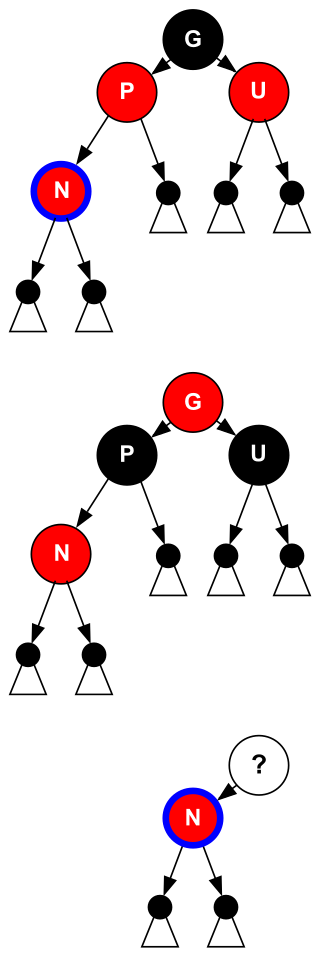 
##### случай 3
Если дошли до рута из случая 2 то все заебись
##### случай 4
Если отец красный и рут, то делаем его черным 
##### случай 5
Если дядя черный, а связь между отцом и сыном не в ту же сторону, что между дедом и отцом, то делаем поворот и переходим к случаю 6.

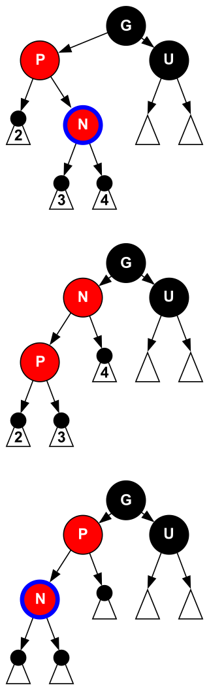 
##### случай 6
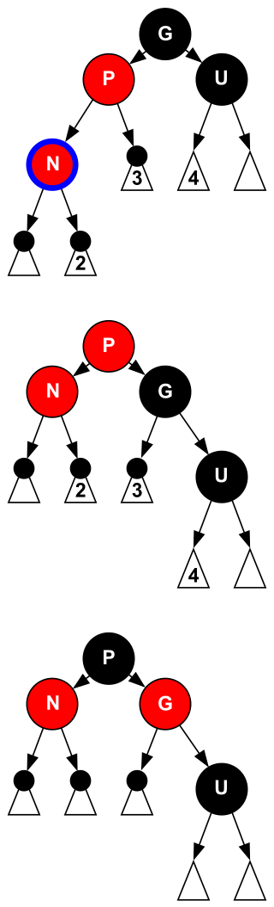 
#### Удаление 
Тут людей ебут
##### случаи простые
- удаляем рут без детей. Очевидно как
- удаляем ноду с 2 детьми -- заменяем ее на следющий ключ (самый левый ребенок правого поддерева) и удаляем его. Он имеет не более 1 ребенка.
- удляем ноду с 1 ребенком -- заменяем ее ребенком и красим в черный.
- удаляем красную ноду без детей -- похуй, просто удаляем.
- удаляем черную ноду без детей -- пиздец.
заменяем ее на нулл у родителя, а дальше...
(рассматриваем текущую ноду, т.е. мы можем выше подняться)
##### случай 1
если текущая нода это рут, то мы удалили все что хотели
##### случай 2
Если родитель черный, брат черный и все дети брата черные, то ~~вы негр~~ красим брата в красный. Теперь в поддереве с корнем в отце текущей ноды на 1 меньше черная высота, но в другом поддереве может быть не так, поэтому поднимаемся выше (N = N->parrent)

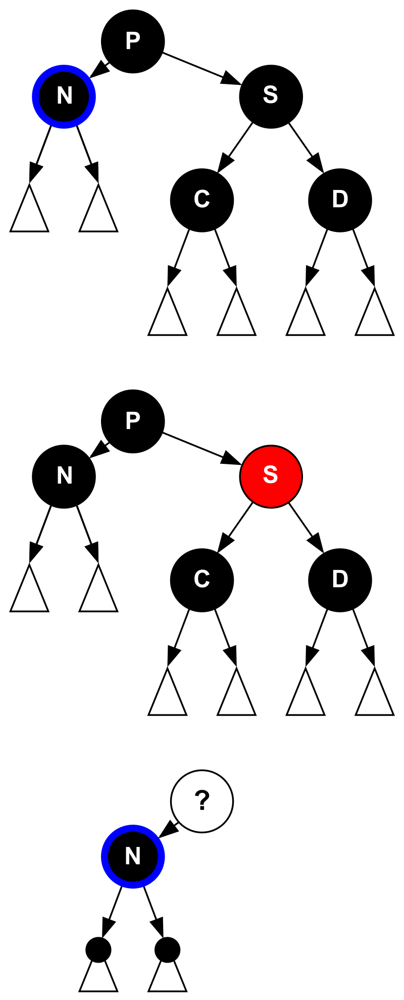 
##### случай 3
Если брат красный а все остальные черные, делаем поворот P (теперь брат -- корень поддерева), красим его в черный а родителя в красный. Теперь бывший ближний племянник стал братом, смотрим его детей и переходим в 4, 5 или 6 случай.

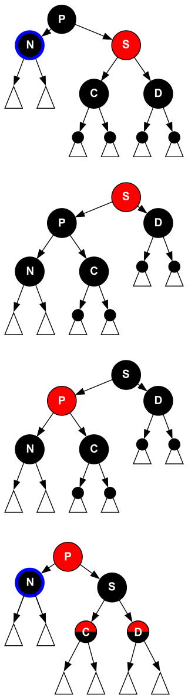 
##### случай 4
Если дети черные то красим родителя в черный а брата в красный.

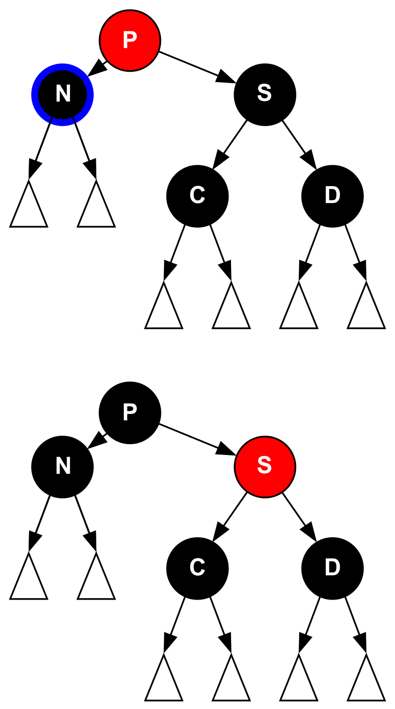 
##### случай 5
если ближний племянник красный, то поворачиваем так чтобы он стал братом, спускаем на 1 слой вниз красный цвет и идем в 6 случай.

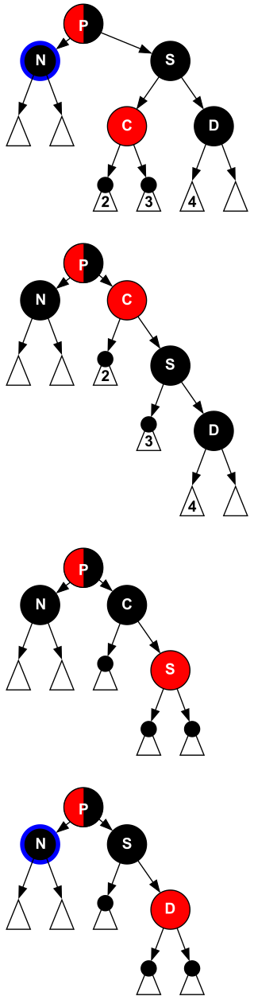 
##### случай 6
Если дальний племянник красный, то поворачиваем так, чтобы брат стал корнем поддерева,красим дальнего племянника и родителя в черный, а брата в цвет родителя.

 

Вообще рофл рбт в том, что в отличие от АВЛ мы делаем не лог вращений, а константу (<= 2 при вставке и <= 3 при удалении).
>хватит и этих

## 33. Графы и возможные формы их описания. Нахождение кратчайшего пути на графе.
## 34. Алгоритм Дейкстры, алгоритм Форда.
## 35. Графовые алгоритмы – обзор.
## 36. Хеширование, проблемы коллизий.
Хеширование -- метод поиска, состоящий в вычислении хеш-кода (причем однозначно) от ключа и использование его в качестве основы для поиска (индексирование в памяти по хеш-коду занимает О(1)). Т.е. хеш-функция отображает множество ключей на множество целых неотрицательных чисел. Но такое отображение не взаимно однозначно (в общем случае), так как множество ключей больше множества значений хеш-функции. Поэтому происходят коллизии.
Коллизией называется ситуация при которой для неравных ключей x и y h(x) = h(y).
Виды хеширования:
- По способу хранения
    - статическое -- один раз заполнить и дальше только проверка на наличие
    - динамическое -- удаляем, добавляем, смотрим, свобода ебать
- По виду хеш-функции
    - детерминированная
    - случайная
В целом поиск это Θ(n), но вообще хеширование более эффективно. При некоторых допущениях мат. ожидание на поиск О(1), вставка и удаление это тоже О(1), но не гарантируется, что времяна операцию мало так как может быть необходим рехеш или еще какая-нибудь хуйня.
## 37. Методы обработки коллизий в хешировании.
Че такое коллизии смотрим выше.
### Цепочный метод
В данном методе каждая ячейка хеш-таблицы хранит не элемент, а список (или стек), в который добавляются элементы. Впринципе если очень нужно можно хранить бст, в джаве вроде так сделано для интов и даблов
### Открытая адресация
В данном методе все элементы хранятся линейно, при коллизии мы будем искать другую ячейку 
- последовательно (i, i + 1, i + 2)
- линейно (i + q, i + 2q, i + 3q) 
- квадратично (1, 4, 9, 16) 

Коэффициент заполнения показывает какой процент памяти занят значениями. При высоком коэффициенте мы будем долго искать пустое место, надо рехеш.

>Хз куда это пихнуть, но наш хеш цикличный btw

Поиск соответственно осуществляется до первого пустого места или до нахождения нужного элемента. Из этого возникает проблема удаления, т.к. если удалить элемент, то он (как ни странно) должен стать пустым, но тогда мы похерим поиск. Анлак. Решается это двумя способами:
- без меток простым сдвигом
- метками. при удалении мы просто помечаем удаленную вершину мертвой. при вставке на это место вставлять можно, но при поиске оно как-бы занято. 

#### Двойное хеширование
Для этого возьмем две независимые хеш-функции h1(k), h2(k) и будем хешировать так:
- смотрим h1(k), если пусто, заебись
- если не пусто, смотрим (h1(k) + q*h2(k))mod(m), где m -- размер хеша.
Асимптотически это ровно то же самое, что обычный линейный метод разрешения коллизий, но вероятность совпадения двух независимых хеш-функций крайне мала.
h1 может быть обычной ХФ, h2 же должна возвращать
- не 0
- независимые от h1 значения
- взаимно простые с величиной ХТ значения
#### Кукушечное хеширование
Это вообще заебись крутая идея.
Заводим 2 хеш-функции: h1, h2.
Далее смотрим на полученные ячейки:
1. если одна из них пустая супер, мы победили, кладем элемент
2. иначе выбираем любой из элементов, запоминаем его и кладем на его место новый
3. смотрим на результат другой хеш-функции от запомненного элемента.
4. если не зациклились, ищем таким образом пустое место или идем до зацикливания
5. иначе выбираем другие ХФ и рехешим
6. увеличиваем размер таблицы по необходимости.

Удаление и проверка на наличие элемента очевидно тривиальны
Преимуществом данного метода над цепочным является локальность в кэше для малых таблиц, но коэффинцент заолнения желательно держать не выше 50%, иначе поиск свободного места становится трудоемким

## 38. Хеш-таблица на основе перемешанной таблицы
Это тип хеш с открытой адресацией. Я не знаю стоит ли писать сюда что-то, ибо в вопросе выше я +- обрисовал ситуацию, так что жду предложений
## 39. Хеш-таблица на основе связанных списков
Надо полагать это цепочный метод, иначе это не имеет никакого смысла.
Все про хеш, хеширование смотрим выше.
Как бы сюда тоже нечего писать особо, все было описано выше, потом мб вернусь
## 40. Построение обратной польской записи выражения.
Обратная польская запись, или же постфиксная нотация - это форма, которая представляет из себя выражение, в котором оператор находится после операндов:

`a a +`

В инфиксной же записи, знак находится между операндами. Для вычисления выражения, записанного в инфиксной форме, необходимо его предварительно проанализировать с учётом приоритета операторов и скобок. В свою очередь обратная польская запись такого не требуют, так как операторы записываются в порядке их вычисления и без скобок.

Для преобразования выражения в инфиксной форме в постфиксную используют алгоритм Дейкстры (не тот, который для поиска кратчайшего пути в графе). Принцип его работы:
- Проходим исходную строку;
- При нахождении **числа**, заносим его в выходную *строку*;
- При нахождении **оператора** заносим его в *стек*;
- Вытаскиваем в выходную *строку* все **операторы**, имеющие приоритет выше рассматриваемого;
- При нахождении **открывающей** скобки заносим её в стек;
- При нахождении закрывающей скобки, вытаскиваем все операторы из стека до открывающей скобки, а открывающую скобку удаляем из стека.

Например `(2 + 3) * (4 - 1)` в польской нотации будет иметь вид: `2 3 + 4 1 - *`

После получения постфиксной записи, необходимо вычислить её значение. Для этого воспользуемся алгоримом очень похожим на алгоритм Дейкстры, только этот будет использовать всего один стек.

Принцип работы:
- Проходим постфиксную запись;
- При нахождении числа заносим его в стек;
- При нахождении бинарного оператора, берем 2 последних значения из стека в обратном порядке, выполняем операцию, и затем заносим результат обратно в стек;
- При нахождении унарного оператора (допустим минуса), берем последнее значение из стека и делаем с ним операцию (в случае с минусом - отнимаем от 0 данное число) и заносим обратно в стек;
- Последнее значения после работы алгоритма и есть результат.

Необходимо также рассмотреть приоритет операций:
| Оператор | Приоритет |
|---------|------------|
| + | 1 |
| - | 1 |
| * | 2 |
| / | 2 |
| ^ | 3 |
| ~ | 4 |

где **~** - унарный минус. Чем больше число, тем больше приоритет операции.

Обратная польская запись редко используется в повседневной жизни, однако она нашла широкое применения в написании алгоритмов для вычислительной техники типа калькуляторов. Потому что она не подразумевает полный анализ выражения и перевод в польскую натацию работает за О(n), последующий подсчет также работает за О(n).

## 41. Подходы и инструменты к отладке исходного кода.
Отладка исходного кода -- этап разработки программы, на котором обнаруживают и устраняют ошибки.
Данный этап можно разбить на несколько шагов:
1. определить неверное поведение -- что конкретно идет не так
2. воспроизведение бага -- поиск ситуации, в которой проявляется ошибка
3. понимание программы -- какая часть программы выполняется, когда начал проявляться баг, после добавления какой части функциональности и т.д.
4. формирование предположений о местоположении бага -- какой компонент содержит баг, баг находится в компоненте или во взаимодействии
5. проверка предположений. На данном этапе кстати естественно двигаться назад, на 4 шаг
6. устранение бага. На данном этапе также естественно переходить к предыдущим шагам.
Существуют 2 технологии отладки:
- использование отладчиков (дебаггеров) -- программ, которые включают в себя интерфейс для пошагового исполнения программы с возможностью остановки на некоторых строках или при некотором условии
- вывод текущего состояния в произвольном формате (журналирование == логирование)

Для поиска ошибок существуют такие технологии как:
- фаззинг -- подача на вход большого количества случайных данных для стресс-тестирования
- статический анализ -- программа-анализатор ищет небезопасные вызовы функций и прочую мерзость на основе базы правил, содержащей описание небезопасных образцов кода.
- обратная инженерия -- процесс поиска ошибок в программе независимыми исследователями.

Большинство интегрированных сред разработки имеют удобный графический интерфейс для отладки программ, но сами отладчики поставляются с компиляторами или отдельно и зачастую имеют собственный (часто консольный) пользовательский интерфейс.
Примерами служат GDB -- GNU Debugger и LLDB -- LLVM Debugger.
>Может потом вставлю сравнение комманд гдб и ллдб, но тут по настроению вообще
## 42. Директивы подпрограмм. Неявная рекурсия. Пример.
